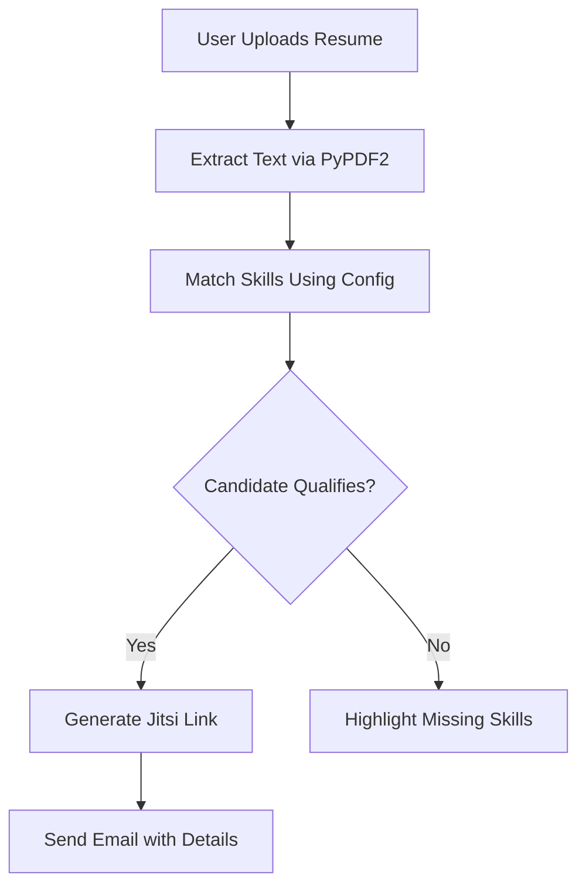

# 🤖 AI-Powered-Recruitment-Assistant

### 📄 Resume Analyzer + Interview Scheduler 🚀

[](https://streamlit.io)
[](https://python.org)
[](https://jitsi.org)

**Automated recruitment workflow** that analyzes resumes, evaluates candidates, and schedules interviews in one click! Powered by AI resume parsing and Jitsi video conferencing.

---

## ✨ Key Features

| Feature | Description |
|---------|-------------|
| 🔍 **Smart Resume Analysis** | Parses PDF resumes and matches skills against job requirements |
| ⚡ **Auto-Scheduling** | Creates Jitsi meetings with unique links when candidates qualify |
| ✏️ **Manual Scheduling** | Flexible option to manually schedule interviews |
| 📧 **Email Automation** | Sends professional interview invites with all details |
| 📊 **Skill Gap Analysis** | Highlights missing skills for rejected candidates |

---

## 🛠️ Tech Stack Deep Dive

### Core Components

1. **`app.py`** (Main Application)
   - Streamlit-powered UI with 3 sections:
     - Resume Analyzer
     - Interview Scheduler
     - About page
   - Handles all user interactions

2. **`utils/` (Core Modules)**
   - 📂 `config.py` - Job role configurations:
     ```python
     roles = {
         "Data Scientist": {
             "mandatory_skills": ["python", "machine learning"],
             "skills": ["sql", "data visualization"]
         }
     }
     ```
   - 🔍 `resume_parser.py` - PDF text extraction:
     - Uses PyPDF2 to parse resumes
     - Converts text to lowercase for case-insensitive matching

   - 🎥 `jitsi_scheduler.py` - Interview coordination:
     - Generates unique Jitsi meeting URLs
     - Sets default time to 24h from current time (UTC)

3. **📧 `email_sender.py`** - SMTP Email Service
   - Requires Gmail App Password (see setup below)
   - Sends formatted interview invites:
     ```
     Subject: Interview for {Role} at {Company}
     
     Dear Candidate,
     Your interview is scheduled for {Time}
     Join: {Jitsi Link}
     ```

---

## 🚀 Installation Guide

### Prerequisites
- Python 3.8+
- Gmail account (for email sending)

### Setup Steps
```bash
1. Clone repository
git clone https://github.com/SimranShaikh20/AI-Powered-Recruitment-Assistant.git
cd AI-Powered-Talent-Scout

2. Install dependencies
pip install -r requirements.txt  # Includes:
streamlit==1.13.0
PyPDF2==2.11.1
smtplib (built-in)

3. Configure Gmail (one-time)
- Enable 2FA: https://myaccount.google.com/security
- Create App Password: https://myaccount.google.com/apppasswords
- Select "Mail" + "Other (Custom Name)"

4. Run the app
streamlit run app.py
```

---

## 🔐 Gmail SMTP Configuration


 Critical Security Note: Never use your actual Gmail password!
 Use App Password with 2-Step Verification enabled

STEP 1: Enable 2-Step Verification
Visit: https://myaccount.google.com/security

STEP 2: Generate App Password
Visit: https://myaccount.google.com/apppasswords
- Select App: Mail
- Select Device: "Streamlit App" (or any custom name)
- Copy the 16-character generated password


---

## 📂 Project Structure
```
AI-Powered-Recruitment-Assistant/
├── app.py                 # Main Streamlit application
├── utils/
│   ├── __init__.py        # Makes utils a Python package
│   ├── config.py          # Job role configurations
│   ├── email_sender.py    # SMTP email functionality
│   ├── jitsi_scheduler.py # Jitsi meeting management
│   └── resume_parser.py   # PDF text extraction logic
├── requirements.txt       # pip dependencies
└── README.md              # Project documentation
```

---

## 🌟 Why This Stands Out
```python
features = {
    "time_saver": "⏳ Reduces hiring workflow from hours → minutes",
    "smart_matching": "🧠 Skill prioritization algorithm",
    "professional_ux": "💼 Clean Streamlit interface",
    "extensible": "🔌 Easy role/skill additions in config.py"
}
```

---

## 🤝 Contributing Workflow

### 1. Fork the repository on GitHub
### 2. Clone locally
```bash
git clone https://github.com/SimranShaikh20/AI-Powered-Recruitment-Assistant.git
cd AI-Powered-Recruitment-Assistant
```

---

## 🚀 Project Workflow (Mermaid Diagram)



---

## 📊 Why Streamlit + Jitsi?

### Streamlit Benefits:
- Interactive web UI with minimal code
- Seamless local-to-cloud deployment
- Ideal for rapid prototyping

### Jitsi Benefits:
- Open-source video conferencing
- No sign-up required for candidates
- Instant room generation with custom URLs

---

## 👤 Author
Created by **Simran Shaikh** with ❤️