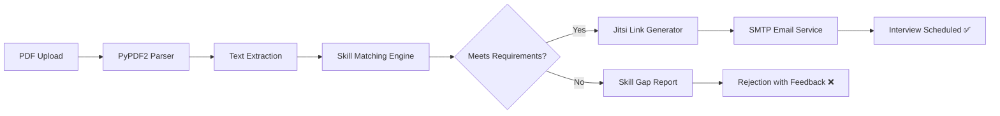

# 🤖 AI-Powered Recruitment Assistant

**Streamline your hiring process with automated resume screening and interview scheduling**

[](https://ai-powered-recruitment-assistant-napxpg8qcggtua5pd5llcy.streamlit.app/)
[](https://python.org)
[](https://streamlit.io)

## 🎯 What This Does

Transform your recruitment workflow from **hours to minutes**:
1. **Upload Resume** → AI extracts and analyzes skills
2. **Smart Matching** → Compares against job requirements  
3. **Auto-Decision** → Qualifies or rejects with feedback
4. **Instant Scheduling** → Creates Jitsi meeting + sends email invite

## 🔥 Key Features

- **📄 Smart Resume Parsing** - Extracts skills from PDF resumes using PyPDF2
- **🧠 Intelligent Matching** - Compares candidate skills against predefined job requirements
- **⚡ Auto-Scheduling** - Generates unique Jitsi meeting links for qualified candidates
- **📧 Email Automation** - Sends professional interview invitations via SMTP
- **📊 Skill Gap Analysis** - Shows missing skills for rejected candidates
- **🎯 Multi-Role Support** - Configurable for different job positions

## 🏗️ How It Works (Backend Architecture)



### Backend Components:

**1. Resume Parser (`resume_parser.py`)**
```python
# Extracts text from PDF and normalizes for matching
def extract_text_from_pdf(pdf_file):
    return PyPDF2.PdfReader(pdf_file).extract_text().lower()
```

**2. Skill Matching Engine (`config.py`)**
```python
# Predefined job requirements with mandatory vs optional skills
JOB_ROLES = {
    "Data Scientist": {
        "mandatory_skills": ["python", "machine learning", "statistics"],
        "preferred_skills": ["sql", "tensorflow", "aws"]
    }
}
```

**3. Interview Scheduler (`jitsi_scheduler.py`)**
```python
# Generates unique meeting rooms and schedules 24h ahead
def create_jitsi_meeting():
    room_id = generate_unique_id()
    return f"https://meet.jit.si/{room_id}"
```

**4. Email Service (`email_sender.py`)**
```python
# SMTP integration with Gmail App Passwords
def send_interview_email(candidate_email, meeting_link, datetime):
    # Professional email template with meeting details
```

## 🚀 Quick Start

### Prerequisites
- Python 3.8+
- Gmail account with App Password enabled

### Installation
```bash
# 1. Clone and setup
git clone https://github.com/SimranShaikh20/AI-Powered-Recruitment-Assistant.git
cd AI-Powered-Recruitment-Assistant
pip install -r requirements.txt

# 2. Configure Gmail App Password (required for email sending)
# Visit: https://myaccount.google.com/apppasswords
# Generate 16-character password for "Mail" app

# 3. Run the application
streamlit run app.py
```

### Gmail Setup (One-time)
1. **Enable 2-Step Verification**: [Google Security Settings](https://myaccount.google.com/security)
2. **Generate App Password**: [App Passwords](https://myaccount.google.com/apppasswords)
   - Select "Mail" → "Other (Custom name)"
   - Copy the 16-character password
3. **Use App Password** (not your regular Gmail password) in the application

## 📁 Project Structure
```
AI-Powered-Recruitment-Assistant/
├── app.py                    # Main Streamlit UI
├── requirements.txt          # Dependencies
├── utils/
│   ├── config.py            # Job roles & skill requirements
│   ├── resume_parser.py     # PDF text extraction
│   ├── jitsi_scheduler.py   # Meeting link generation
│   └── email_sender.py      # SMTP email automation
└── Documentation/
    └── SRS.docx            # System requirements
```

## 🔧 Configuration

Add new job roles in `utils/config.py`:
```python
JOB_ROLES = {
    "Your New Role": {
        "mandatory_skills": ["skill1", "skill2"],
        "preferred_skills": ["skill3", "skill4"],
        "minimum_score": 70  # Percentage threshold
    }
}
```

## 🛠️ Tech Stack

- **Frontend**: Streamlit (Interactive web interface)
- **PDF Processing**: PyPDF2 (Resume text extraction)
- **Video Conferencing**: Jitsi Meet (Open-source, no signup required)
- **Email Service**: SMTP with Gmail (Automated notifications)
- **Deployment**: Streamlit Cloud (Free hosting)

## 🎯 Use Cases

- **HR Departments**: Automate initial resume screening
- **Startups**: Quick candidate evaluation without complex ATS
- **Recruitment Agencies**: Bulk resume processing
- **Technical Interviews**: Skill-based filtering for developers

## 🤝 Contributing

1. Fork the repository
2. Create feature branch (`git checkout -b feature/new-feature`)
3. Commit changes (`git commit -m 'Add new feature'`)
4. Push to branch (`git push origin feature/new-feature`)
5. Open Pull Request

## 📝 License

This project is open source and available under the [MIT License](LICENSE).

## 👨‍💻 Author

**Simran Shaikh** - [GitHub Profile](https://github.com/SimranShaikh20)

---

⭐ **Star this repo** if you found it helpful!